# AlgoTradingAssignment  
## Files Description  
#### reference  
Research reports of factors  
#### result  
Factor backtest results and correlation result pictures  
#### factors_calc.py  
Implementation of factors  
#### factors_utils.py  
Tool codes required for factor implementation and correlation calculation  
#### factors_corr.ipynb  
Calculation of factor correlations  

## Data Description  
The data source is the database I used during my internship in quantitative private equity fund, using the minute-frequency and daily-frequency data interfaces provided by the company.  

## Backtest Description  
**start_date: 20190101**  
**end_date: 20240401**  
**Adjust Position Days: 5 (Week-Frequency)**  
**Group Split Number: 10**  
**Method: Long Short (Long Group 9&10, Short Group 1&2)**  

## Factor Description
Using 1-minute-frequency data and daily-frequency data of A-share stocks, I mined many volume and price factors.  
I select **7** of these factors that perform well and meet the correlation requirements as the assignment submission.  
#### Sharp Ratio:  
LogVol_10Tail_1min: 1.9013  
Vol_MaxStd_1min: 2.5649  
VCV_Daily_Month: 2.3607  
VCV_Daily_Week: 2.4634  
Panic_Small_Order_Pct_1min: 1.2495  
Market_Unique_1min: 2.3484  
Following_Coef_1min: 1.3842  
#### Average Sharp Ratio: 2.0389  
#### Correlation:  
The correlations of the selected factors are all below 0.5.  
**Correlation Sheet**  
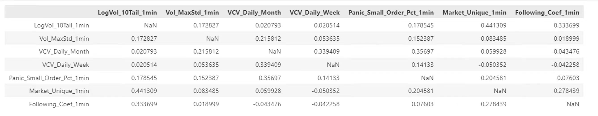  
**Correlation Matrix**  
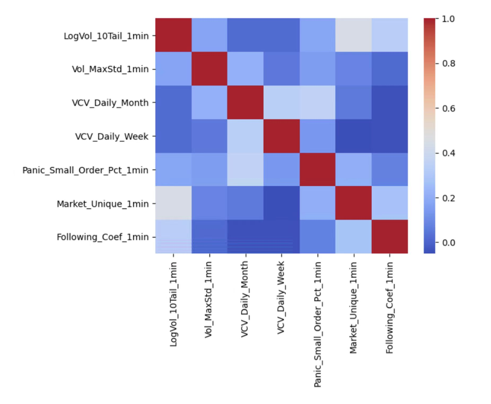  

### LogVol_10Tail_1min  
**Reference: 兴业证券 - 高频研究系列四—成交量分布中的Alpha**  
**Function: factors_calc.LogVol_10Tail_1min()**  
**Category: 1-minute-frequency data converted into daily-frequency factor**  
**Result:**  
Indicator Results  
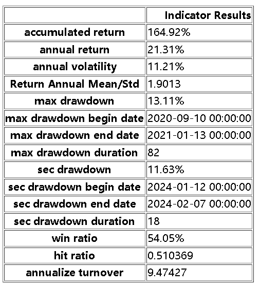  
PnL Curve  
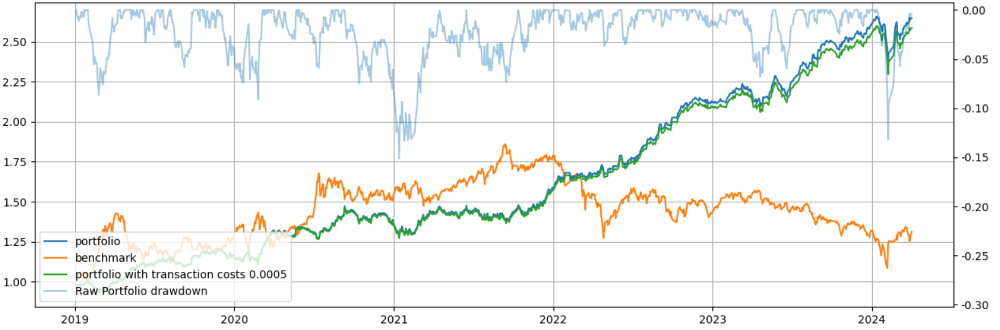  

### Vol_MaxStd_1min  
**Reference: 兴业证券 - 高频研究系列四—成交量分布中的Alpha**  
**Function: factors_calc.Vol_MaxStd_1min()**  
**Category: 1-minute-frequency data converted into daily-frequency factor**  
**Result:**  
Indicator Results  
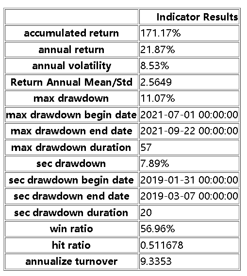  
PnL Curve  
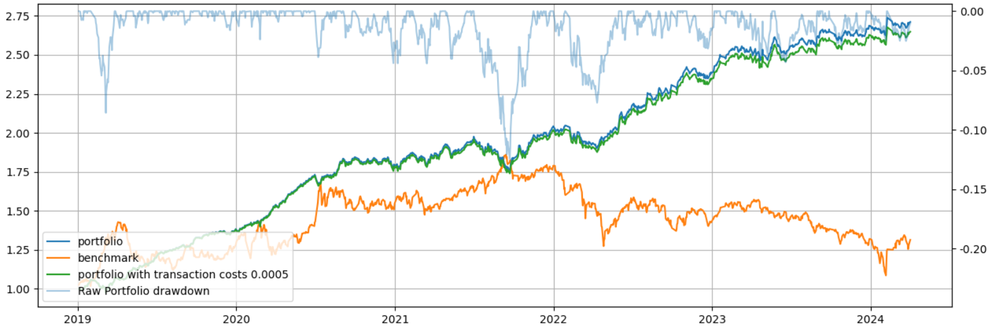  

### VCV_Daily_Month  
**Reference: 招商证券 - 高频寻踪：再觅知情交易者的踪迹**  
**Function: factors_calc.VCV_Daily()**  
**Category: daily-frequency data converted into daily-frequency factor**  
**Result:**  
Indicator Results  
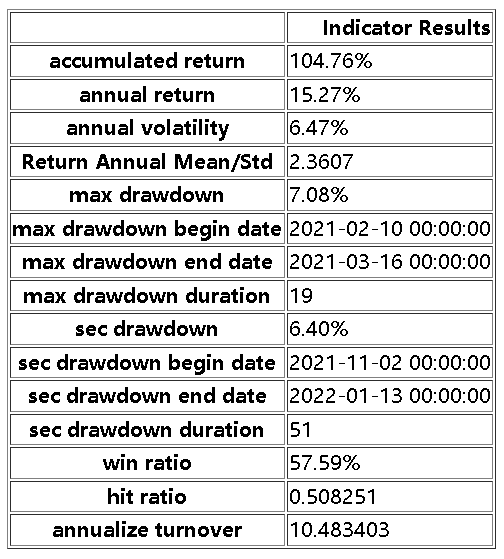  
PnL Curve  
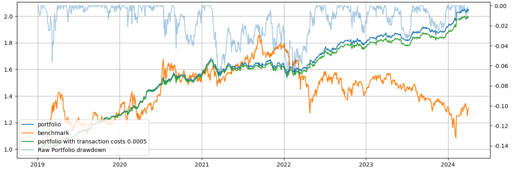  

### VCV_Daily_Week  
**Reference: 招商证券 - 高频寻踪：再觅知情交易者的踪迹**  
**Function: factors_calc.VCV_Daily()**  
**Category: daily-frequency data converted into daily-frequency factor**  
**Result:**  
Indicator Results  
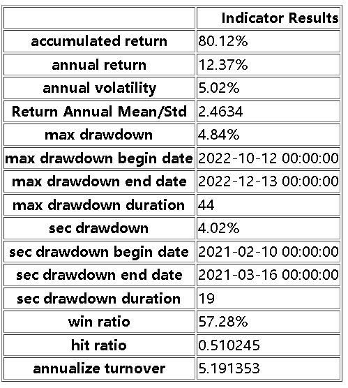  
PnL Curve  
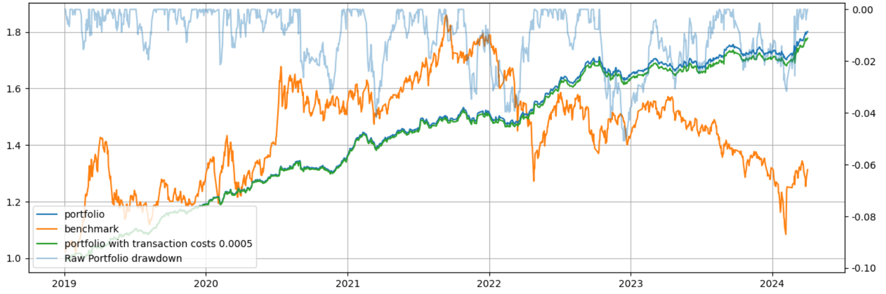  
 

### Panic_Small_Order_Pct_1min  
**Reference: 方正证券 - 显著效应、极端收益扭曲决策权重和“草木皆兵”因子——多因子选股系列研究之八**  
**Function: factors_calc.Panic_Small_Order_Pct_1min()**  
**Category: daily-frequency data converted into daily-frequency factor**  
**Result:**  
Indicator Results  
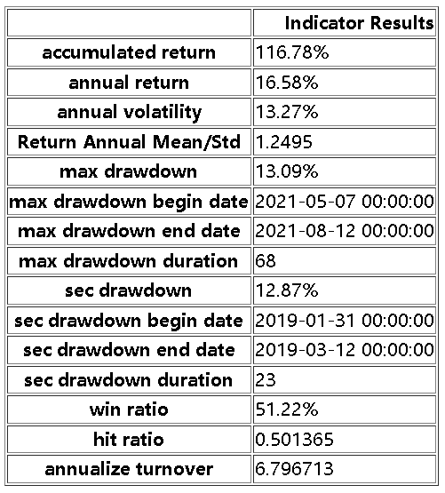  
PnL Curve  
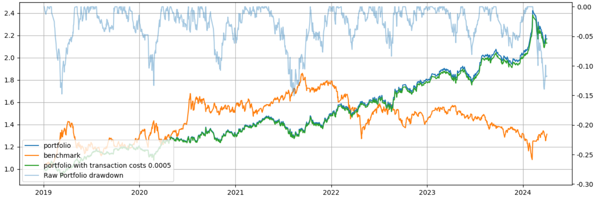  
 

### Market_Unique_1min  
**Reference: 方正证券 - 个股成交额的市场跟随性与“水中行舟” 因子——多因子选股系列研究之九**  
**Function: factors_calc.Market_Unique_1min()**  
**Category: 1-minute-frequency data converted into daily-frequency factor**  
**Result:**  
Indicator Results  
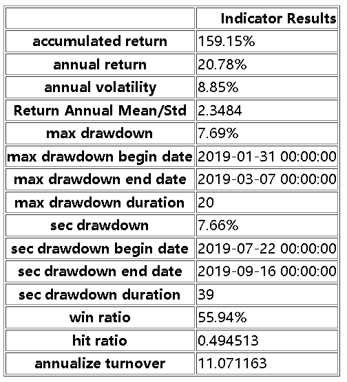  
PnL Curve  
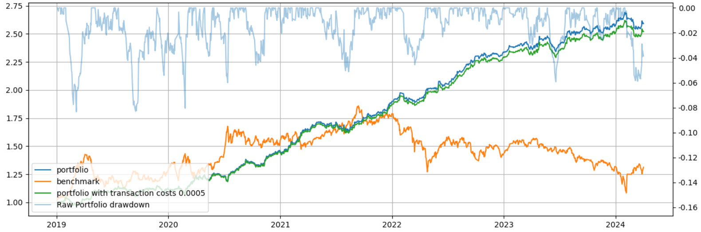  

### Following_Coef_1min  
**Reference: 方正证券 - 大单成交后的跟随效应与“待著而救”因子——多因子选股系列研究之十一**  
**Function: factors_calc.Following_Coef_1min()**  
**Category: 1-minute-frequency data converted into daily-frequency factor**  
**Result:**  
Indicator Results  
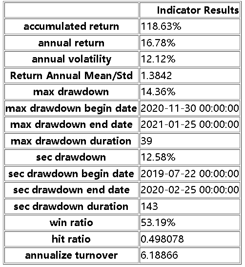  
PnL Curve  
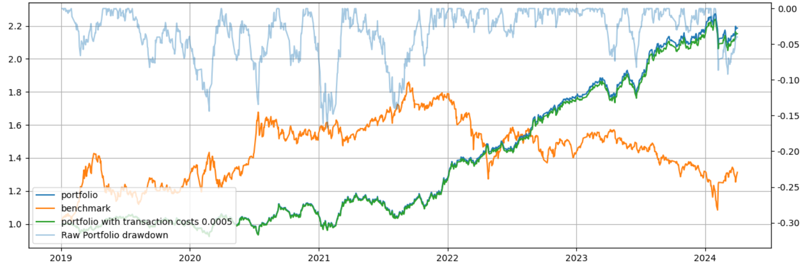  
